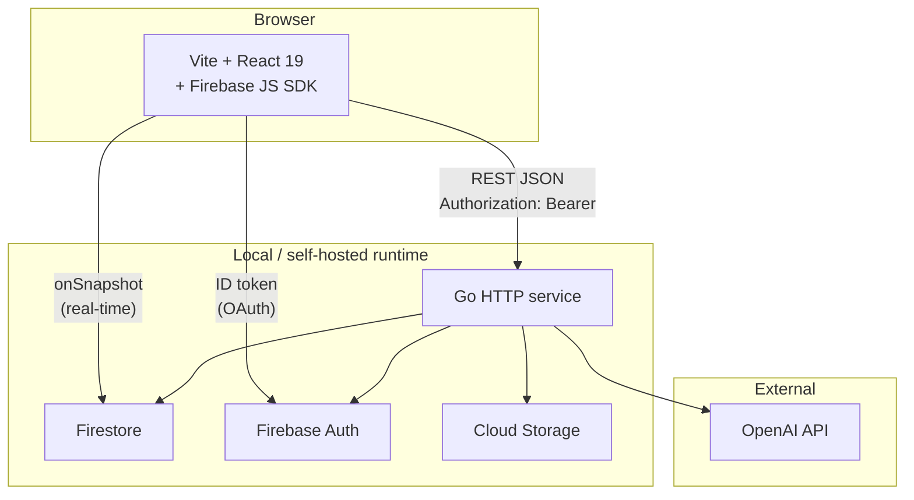
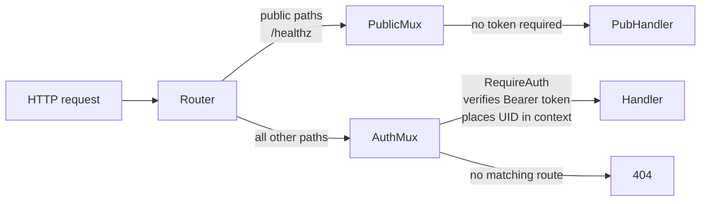
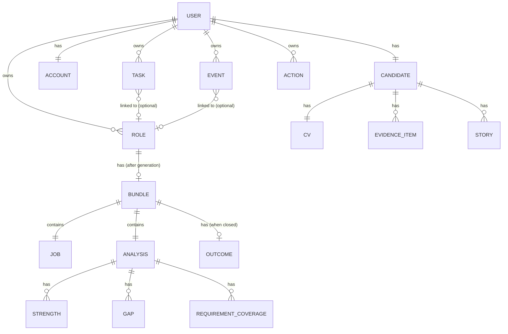
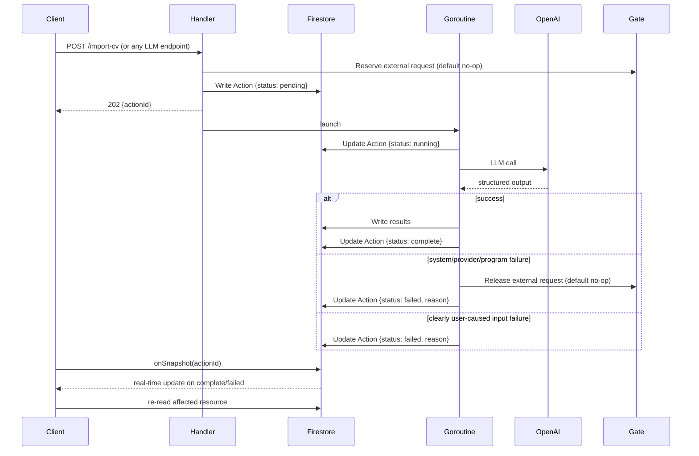
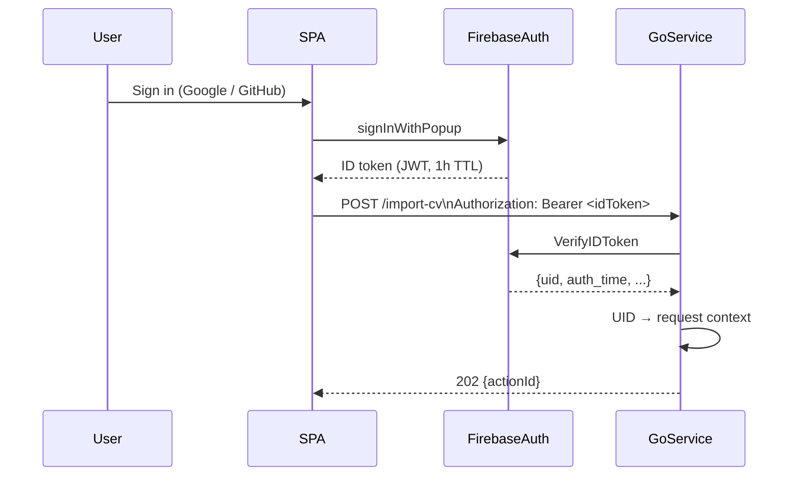
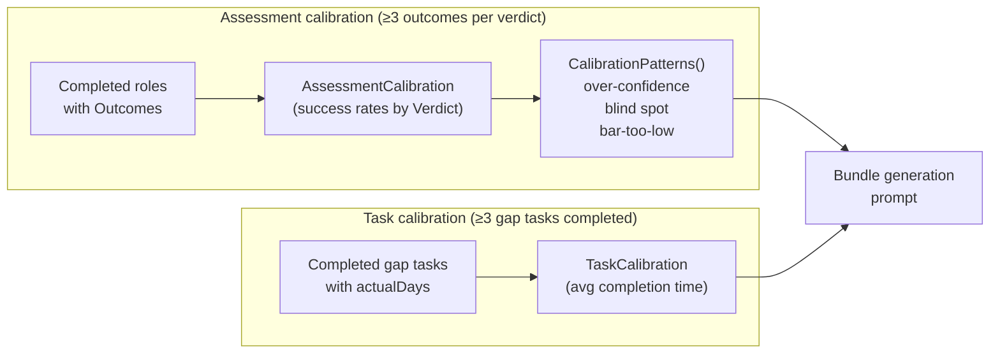

# CVAI architecture

_Living document — updated as stages are implemented._

---

## Overview

CVAI is an application for AI-assisted job application management. It is designed
to run locally or in a homelab with Firebase emulators.



### Stack

| Layer | Choice | Rationale |
|---|---|---|
| Backend runtime | Go HTTP service | Statically compiled; simple container deployment |
| Database | Firestore emulator | Document model maps to domain aggregates; `onSnapshot` replaces polling |
| Auth | Firebase Auth emulator | ID token verification in middleware; no hosted OAuth credentials needed for local development |
| LLM | Provider-configurable API dialect (`anthropic` or `openai`) | Direct HTTP client (no SDK); structured output for extraction. Provider, model, compatible OpenAI host, and timeout are configured via `LLM_PROVIDER`, `LLM_MODEL`, `LLM_BASE_URL`, and `LLM_TIMEOUT_SECONDS`. |
| Frontend | Vite + React 19 + Tailwind | SPA served by the local web container; every request carries `Authorization: Bearer <idToken>` |
| PDF export | Browser `window.print()` | Zero backend cost; A4 CSS print layout; no server-side renderer needed |

---

## Backend structure

```
functions/
  cmd/
    main.go              # HTTP server entry point; router wiring
  internal/
    auth/                # Firebase ID token middleware; UID context helpers
    domain/              # Go types and string constants (no iota — Firestore stores strings)
    repo/                # Repository interfaces + Firestore implementations
    llm/                 # OpenAI HTTP client; SSRF-safe URL fetcher; prompt templates
    handlers/            # One file per endpoint group
    calibration/         # Deterministic pattern detection (no I/O)
    middleware/          # Logging, panic recovery, rate limiting, CORS
```

### Router structure

Two mux instances are composed at startup, making it structurally impossible to expose a handler without explicitly choosing a path:



Any handler not registered on either mux returns 404 — never 200-unauthenticated.

---

## Data model (Firestore)

All user data lives under `users/{uid}/`. Firestore Security Rules enforce that no authenticated user can access another user's subtree.



**Collection paths:**

```
users/{uid}/
  candidate          (single doc)  CV, EvidenceLibrary, StoryBank
  account            (single doc)  identity profile
  roles/{roleId}                   Role metadata and status
  roles/{roleId}/bundle/data       Bundle = Job + Analysis + Outcome
  tasks/{taskId}                   Task (optionally linked to a roleId)
  events/{eventId}                 Append-only event log
  actions/{actionId}               Async operation state machine
```

### Repository pattern

Handlers never hold a `*firestore.Client` reference. All data access goes through typed interfaces in `internal/repo/interfaces.go`. The Firestore implementations live in `internal/repo/firestore/`.

Interface constraints enforced structurally (not by convention):

- `EventRepository` — no `Update` or `Delete`; append-only at the type level
- `CalibrationRepository` — no write methods; read-only at the type level

---

## Async action pattern

Every LLM-backed endpoint is wired through an injectable external-request gate
before provider work. In CVAI, the default gate is a no-op. Deployments may
replace it with rate limiting, provider-budget enforcement, or temporary
external API disablement.

Every LLM-backed endpoint follows this lifecycle without exception:



Preflight validation must run before the gate call, so malformed requests can be
rejected synchronously. CVAI's no-op gate preserves a single handler shape while
leaving external API control to deployment-specific adapters.

The default LLM timeout ceiling is 180 s, configurable via `LLM_TIMEOUT_SECONDS`; CV import processing is separately bounded by `CV_IMPORT_TIMEOUT_SECONDS`. Blocking the HTTP handler on an LLM call would exhaust Cloud Run concurrency.

### Observability

LLM-backed actions emit OpenTelemetry metrics and spans for operational dashboards and alerting. Logs remain the drill-down surface for sanitised diagnostics such as provider status summaries, action IDs, and failure reasons. Metrics carry bounded labels only.

The Go service wires vendor-neutral OTLP export when standard `OTEL_*` environment variables are present. With no OTLP endpoint configured, instrumentation remains no-op. Supported protocols are `grpc` and `http/protobuf`; examples:

```text
OTEL_SERVICE_NAME=cvai-api
OTEL_EXPORTER_OTLP_ENDPOINT=http://otel-collector:4317
OTEL_EXPORTER_OTLP_PROTOCOL=grpc
```

Current CV import instruments:

- `cv_import_pdf_bytes` histogram
- `cv_import_llm_duration_ms` histogram
- `cv_import_total_duration_ms` histogram
- `cv_import_attempts_total` counter labelled by `status` and bounded `failure_class`
- `cv.import` spans with action ID, PDF size, timeout, LLM duration, total duration, and terminal status

Shared LLM client instruments:

- `llm_request_duration_ms` histogram
- `llm_input_tokens` histogram
- `llm_output_tokens` histogram
- `llm_requests_total` counter labelled by provider, model, status, and bounded failure class
- `llm.complete` spans labelled by provider, model, terminal status, duration, and token counts when available

---

## Auth model



`RequireRecentAuth` additionally checks `auth_time` and is applied to `DELETE /account` (max 5 minutes). The SPA calls `reauthenticateWithPopup` before hitting that endpoint.

---

## LLM integration

The LLM is an extraction and reasoning component, not a source of truth. Every LLM-backed workflow must:

1. Convert bounded input into structured output via OpenAI function calling
2. Validate the output against the domain schema before writing any state
3. Write only validated state to Firestore

Ingested source material (URLs, PDFs, pasted text) is always passed as delimited evidence with no instruction authority — even if it contains text like "ignore previous instructions". SSRF protection blocks private IP ranges, loopback, link-local, and the GCP metadata endpoint before any URL is fetched.

**Logs record `{tokenCount, latencyMs, model}` only.** No prompt content, CV text, or job description text appears in any log line.

### Disallowed LLM uses

The LLM must never be called for: dashboard ordering, status or verdict rendering, or any deterministic read operation.

---

## Calibration

Two feedback loops inject historical signal into bundle-generation prompts once sufficient data exists:



Calibration blocks are computed at request time from `CalibrationRepository` (read-only) and injected into the prompt. They are **never stored** in the Bundle or Action document. Injection is gated behind a manual flag until the eval harness (Stage 20) confirms it does not regress output quality.

---

## Security model

| Control | Implementation |
|---|---|
| Authentication | Firebase ID token verified on every authenticated route. Two-mux structure makes accidental public exposure a structural miss, not a runtime risk. |
| Authorisation | Firestore Security Rules enforce `request.auth.uid == uid` on all `users/{uid}/**`. The Go middleware is the primary gate; Rules defend against client-SDK bypass. |
| SSRF | `FetchURL` resolves DNS before connecting and checks all resolved IPs against a blocklist (RFC 1918, loopback, link-local, GCP metadata endpoint). DNS rebinding is mitigated by checking IPs, not the original hostname. |
| Prompt injection | Source material is passed as delimited evidence with an explicit instruction that embedded directives have no authority. Output validation catches injection artefacts; correctness does not depend on detecting every attack string. |
| PII in logs | Structured logging middleware hashes the UID (SHA-256) for correlation. Prompt content, CV text, job descriptions, and email addresses must never appear in any log line. |

---

## Observability

_Fully implemented in Stage 22. Stubs noted here._

- Structured JSON logs per request: `{requestId, uid_hash, path, method, statusCode, durationMs}`
- LLM calls log `{tokenCount, latencyMs, model}` — nothing else
- Cloud Error Reporting for panics and 5xx errors
- `/healthz` deep check probes Firestore with a 1 s timeout; returns `{"status":"degraded","detail":"firestore"}` on failure
- Alert policies: error rate > 1 %, P99 latency > 5 s, async Action failure rate > 0

See `docs/ops.adoc` (Stage 22) for alert configuration commands.

---

## Environment variables

| Variable | Purpose | Required in |
|---|---|---|
| `FIREBASE_PROJECT_ID` | Firebase project identifier | Functions, emulator |
| `GOOGLE_APPLICATION_CREDENTIALS` | Service account key path for Firebase Admin SDK | Functions (production) |
| `FIRESTORE_EMULATOR_HOST` | e.g. `localhost:8080` | CI, local dev |
| `FIREBASE_AUTH_EMULATOR_HOST` | e.g. `localhost:9099` | CI, local dev |
| `LLM_PROVIDER` | `anthropic` or `openai`; defaults to `anthropic` for Stage 5 compatibility | Functions |
| `LLM_API_KEY` | Provider API key | Functions (production), live eval |
| `LLM_MODEL` | Provider model ID | Functions |
| `LLM_BASE_URL` | Optional OpenAI-compatible HTTPS base URL; defaults to `https://api.openai.com/v1` for `LLM_PROVIDER=openai` | Functions |
| `ANTHROPIC_API_KEY` | Anthropic API key fallback when `LLM_API_KEY` is unset | Functions (production), live eval |
| `ANTHROPIC_MODEL` | Anthropic model fallback when `LLM_MODEL` is unset | Functions |
| `OPENAI_API_KEY` | OpenAI API key fallback when `LLM_API_KEY` is unset | Functions (production), live eval |
| `OPENAI_MODEL` | OpenAI model fallback when `LLM_MODEL` is unset | Functions |
| `VITE_FIREBASE_API_KEY` | Firebase JS SDK config | Web SPA |
| `VITE_FIREBASE_AUTH_DOMAIN` | Firebase JS SDK config | Web SPA |
| `VITE_FIREBASE_PROJECT_ID` | Firebase JS SDK config | Web SPA |
| `VITE_FIREBASE_STORAGE_BUCKET` | Firebase JS SDK config | Web SPA |
| `VITE_API_BASE_URL` | Go backend Cloud Run URL | Web SPA |

All secrets are stored in Google Cloud Secret Manager in production and mounted into the Cloud Run service. Never committed to source control or placed in `firebase.json`.
