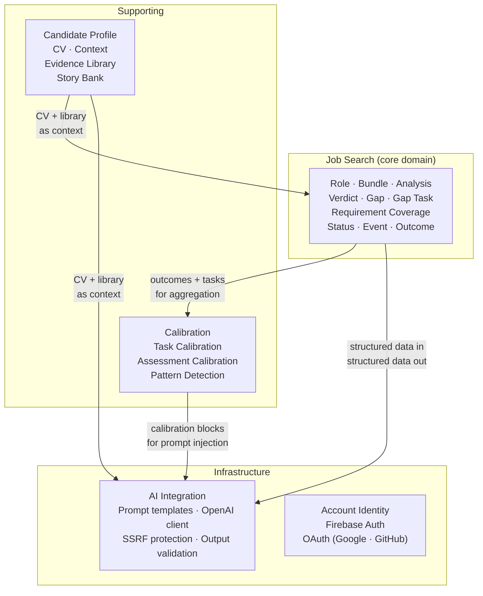

# Domain model

_Design reference for Stage 1 implementation. Read before defining Go types, repository interfaces, or Firestore collection structure. Remove this note once Stage 1 is complete._

---

## Ubiquitous language glossary

These terms have precise meanings in CVAI. They appear in Firestore field names, Go string constants, and LLM prompt instructions. Inconsistent use is a bug.

| Term | Precise meaning |
|---|---|
| **Role** | A specific job opportunity ingested into CVAI. Not the external job posting (the source material) but the CVAI representation: metadata, structured job data, analysis, and tracked state. |
| **Bundle** | The cluster of LLM-generated artefacts produced for a Role in a single generation pass: structured `job` document, `analysis` document, and markdown artefacts (suitability report, role matrix). A Role without a Bundle has been manually entered; a Role with a Bundle has been AI-analysed. |
| **Analysis** | The structured LLM assessment of a Candidate's fit for a Role. Contains: Verdict, a list of Strengths, a list of Gaps, and Requirement Coverage entries. |
| **Verdict** | A categorical judgment (`CLEAR_FIT`, `FIT`, `POSSIBLE_FIT`, `WEAK_FIT`, `OVERQUALIFIED`, or `UNFIT`) representing the LLM's overall suitability assessment. Stored as a string enum; never derived at display time. |
| **Gap** | A job requirement that the Candidate's CV does not demonstrably meet. A Gap may have an associated Gap Task. |
| **Gap Task** | A personal development action derived from a Gap (e.g. "Obtain AWS Solutions Architect certification"). Tracked in the Tasks collection with `source: "gap"`. Carries `estimated_days`, `feasible_within_one_week`, `created_at`, `completed_at`, and an optional `actual_days` override used for calibration. |
| **Requirement Coverage** | For each job requirement: whether the Candidate has evidence that meets it (`met`), partially meets it (`partial`), or does not meet it (`unmet`). Stored per-requirement in the Analysis document. |
| **Evidence Library** | A structured collection of the Candidate's proof points (project outcomes, certifications, quantified achievements) that the LLM draws on when assessing Requirement Coverage. |
| **Story Bank** | A collection of the Candidate's interview-ready narratives, each indexed to one or more competencies (leadership, technical depth, conflict resolution, etc.). |
| **Quick Analysis** | A lightweight pre-ingestion LLM pass that assesses a Candidate's fit for a role before a full Bundle is generated. Returns a suitability summary, likely fit level, key matching abilities, important gaps, effort estimates to close those gaps, and a continue/abandon recommendation. Results are ephemeral; no Role document is written unless the user continues to full ingestion. Rate-limited per UID to control external API use. |
| **Status** | The current lifecycle state of a Role application: `interested`, `applied`, `phone_screen`, `interview`, `offer`, `rejected`, `withdrawn`, `archived`. Stored as an enum; transitions are recorded as Events. |
| **Outcome** | A terminal application result (`accepted`, `rejected`, or `closed`) recorded against a Role when it reaches a terminal Status. Paired with the Role's Analysis Verdict and recommendation for Calibration purposes. Never LLM-generated; derived directly from the Event that triggered the terminal status write. |
| **Event** | An immutable log entry recording a state transition or noteworthy occurrence for a Role (status change, interview scheduled, note added). Events are append-only. |
| **Action** | A background operation with a tracked lifecycle (`pending → running → complete / failed`). Created when the backend is invoked for a long-running operation (bundle generation, CV import). The client subscribes to the Action document via `onSnapshot` for live progress. |
| **Task Calibration** | A statistical summary derived from completed Gap Task records: mean actual-vs-estimated effort ratio, per-category breakdown, and feasibility-prediction accuracy. Injected into LLM prompts at bundle generation and reassessment time to scale future `estimated_days` values. Computed from at least 3 completed gap tasks with both `estimated_days` and `actual_days` populated; omitted when data is insufficient. |
| **Assessment Calibration** | A statistical summary of past Verdict and recommendation accuracy measured against eventual Outcomes. Includes per-verdict success rates, role-attribute patterns (remote vs. onsite, domain), recommendation accuracy, and detected Calibration Patterns. Injected into LLM prompts to improve verdict quality over time. Computed from at least 3 Roles with recorded Outcomes. |
| **Calibration Pattern** | A detected divergence between AI assessment and eventual Outcome, with an inferred probable cause and a prompt-level calibration rule. Examples: `CLEAR_FIT` underperforming `FIT` (over-confidence bias), a domain attribute with persistently low success rate (blind spot), or `APPLY_NOW` recommendations not outperforming cautious ones (recommendation bar too low). Computed deterministically from Assessment Calibration data; never LLM-generated. |
| **External Request** | Any operation that calls an external service outside CVAI's own runtime, especially LLM provider calls. External Requests may be rate-limited, timed out, retried, observed, or disabled to control cost, latency, and reliability risk. |

---

## Aggregate design

Aggregates define consistency boundaries — what must be saved atomically, and what can be saved independently.

| Aggregate Root | Owns | Commands |
|---|---|---|
| **Candidate** | CV (structured document), Context (constraints, preferences), Evidence Library, Story Bank | ImportCV, UpdateCV, AddEvidence, UpdateEvidence, AddStory |
| **Role** | Metadata, Job, Analysis, State, Artefacts (resumeMd, coverLetterMd, etc.), Outcome | IngestRole, GenerateBundle, UpdateStatus, Reassess, ReassessGapTask, UpdateArtefacts, ArchiveRole, RecordOutcome |
| **Task** | Description, completion state, source (gap/manual), due date, roleId link, estimated_days, actual_days, created_at, completed_at | CreateTask, CompleteTask, DeleteTask |
| **Event** | Type, date, note, roleId link | RecordEvent (append-only; no update or delete) |
| **Action** | Type, status, progress, roleId link, result reference | CreateAction, UpdateProgress, CompleteAction, FailAction |
| **Account** | User identity profile | GetProfile |

Tasks and Events are modelled as flat Firestore collections (`users/{uid}/tasks`, `users/{uid}/events`) rather than subcollections under Role. The `roleId` field creates a logical relationship without nesting — Firestore's query model does not support cross-collection joins so flat collections are required for cross-role task views.

---

## Domain event catalogue

Domain events are facts in the past tense. In Firestore they are recorded in the `events` flat collection under `users/{uid}/events`.

| Event | Trigger |
|---|---|
| `RoleIngested` | A role URL or text was submitted and stored as a Role document (before Bundle generation). |
| `QuickAnalysisCompleted` | A pre-ingestion Quick Analysis LLM pass completed. Result is ephemeral; no Role has been written. The user chooses to continue ingestion or abandon. |
| `BundleGenerationStarted` | An Action was created for bundle generation. |
| `BundleGenerated` | The LLM generated a complete Bundle (job, analysis, artefacts) for a Role. |
| `StatusUpdated` | The Role's Status was changed, either via structured form or interpreted prompt. |
| `InterviewScheduled` | Specialisation of `StatusUpdated` for the `interview` status — includes date. |
| `OfferReceived` | Role moved to `offer` status. |
| `RoleRejected` / `RoleWithdrawn` | Terminal states. |
| `OutcomeRecorded` | A terminal Status event was written and the corresponding Outcome block was persisted into the Role's Analysis. Feeds Assessment Calibration computation. |
| `GapTaskCreated` | An Analysis Gap was converted into a Task. |
| `GapTaskCompleted` | A Gap Task was marked complete (sets `completed_at`, derives `actual_days`; may trigger reassessment eligibility). |
| `CVImported` | A PDF CV was processed by the LLM and the structured CV was populated. |
| `CVUpdated` | The candidate edited a section of their CV directly. |
| `AccountDeleted` | All user data was erased on the user's request. |

---

## Application service inventory

Each service maps to one or more HTTP endpoints or direct Firestore writes. See [USE_CASES.md](USE_CASES.md) for the full actor-level description of each.

| Service | Description | Handled by |
|---|---|---|
| `QuickAnalysis(url\|text)` | Lightweight pre-ingestion LLM analysis. Returns suitability preview. Does not write a Role. Rate-limited per UID. | Go handler (async Action) |
| `IngestRole(url\|text)` | Parse a job URL or pasted text into a Role document. SSRF protection applied. Does not generate a Bundle. | Go handler |
| `GenerateBundle(roleId)` | Run the LLM pipeline: extract structured job data, generate analysis, produce markdown artefacts. | Go handler (async Action) |
| `InterpretStatusUpdate(roleId, prompt)` | Interpret a free-form user prompt into a structured Event. | Go handler (async Action) |
| `ReassessRole(roleId)` | Re-run analysis for a Role given the current CV and evidence library. | Go handler (async Action) |
| `ReassessGapTask(taskId)` | Re-evaluate whether a specific Gap Task is closed given updated CV or library data. | Go handler (async Action) |
| `ImportCV(source)` | Extract structured CV data from pasted text or URL using the LLM. | Go handler (async Action) |
| `UpdateCV(section, data)` | Directly edit a section of the structured CV (no LLM). Validates against `cv.schema.json`. | Direct Firestore write (SPA) |
| `ExportCVPDF()` | Trigger browser print dialog for the current CV. Client-side only — no backend. | `window.print()` |
| `CreateTask(description, roleId?)` | Manually create a task, optionally linked to a role. | Direct Firestore write |
| `CompleteTask(taskId)` | Mark a task as completed. Sets `completed_at`; derives `actual_days` from `created_at` difference. | Direct Firestore write |
| `UpdateRoleStatus(roleId, status)` | Structured status update (no LLM). Writes an `OutcomeRecorded` event when the new status is terminal. | Direct Firestore write |

---

## Repository interfaces

These are the data access contracts. Handler code must not hold a `*firestore.Client` reference directly — all access goes through these interfaces. The Firestore implementations live in `internal/repo/firestore/`.

| Repository | Methods |
|---|---|
| `RoleRepository` | `List(uid)`, `Get(uid, roleId)`, `Create(uid, metadata)`, `Update(uid, roleId, changes)`, `Delete(uid, roleId)`, `ListWithOutcomes(uid)` |
| `BundleRepository` | `Get(uid, roleId)` (returns job + analysis + artefacts as one bundle), `Write(uid, roleId, bundle)`, `WriteOutcome(uid, roleId, outcome)` |
| `CandidateRepository` | `GetCV(uid)`, `WriteCV(uid, cv, validationErrors)`, `GetContext(uid)`, `WriteContext(uid, context)`, `GetLibrary(uid)`, `WriteLibrary(uid, library)` |
| `TaskRepository` | `List(uid, filters?)`, `ListByRole(uid, roleId)`, `Create(uid, task)`, `Complete(uid, taskId)`, `Delete(uid, taskId)`, `TaskCalibration(uid)` (omits result when fewer than 3 eligible tasks) |
| `EventRepository` | `List(uid, filters?)`, `ListByRole(uid, roleId)`, `Append(uid, event)` — no Update or Delete |
| `ActionRepository` | `Create(uid, action)`, `Update(uid, actionId, progress)`, `Complete(uid, actionId, result)`, `Fail(uid, actionId, error)`, `Get(uid, actionId)` |
| `AccountRepository` | `GetProfile(uid)`, `Delete(uid)` |
| `CalibrationRepository` | `AssessmentCalibration(uid)` (read-only; omits result when fewer than 3 data points per verdict group). Source of truth is the raw Outcome and Verdict data in `BundleRepository` — `CalibrationRepository` never writes. |

Structural invariants enforced at the interface level (not by convention):

- Every persisted CV write stores the CV and the current `cv_validation_errors` list together. Imports compute it in the backend domain validator; direct editor writes compute the same required-field list in the SPA before writing.
- CV-dependent actions must treat a non-empty `cv_validation_errors` list as a validity gate and refuse to run until a subsequent CV save produces an empty list.
- `EventRepository` has no `Update` or `Delete` — append-only at the type level.
- `CalibrationRepository` has no write methods — read-only at the type level.
- The handler layer reads the calibration dict and passes it into the LLM client. The LLM client does not query the repository.

---

## Bounded contexts

All contexts share one Firebase project and one Firestore database, separated by Security Rules and collection namespacing rather than network boundaries. This is appropriate for a solo-developer product at launch.

If a Career Coach or team-facing surface is eventually built, it would become a new bounded context with its own data namespace and an org-layer identity model — at which point the boundary could optionally be promoted to a network boundary.

---

## Calibration framework

### Task ETA calibration

Gap Tasks carry `estimated_days`, `actual_days` (optional override), `created_at`, and `completed_at`. When at least 3 completed gap-evidence tasks have both fields populated, `TaskRepository.TaskCalibration()` returns a compact struct (mean effort ratio, per-category breakdown, feasibility accuracy). This is injected into `GenerateBundle` and `ReassessRole` prompts with explicit scaling rules. When fewer than 3 tasks qualify, the block is omitted entirely — a partial calibration block would introduce noise.

### Assessment calibration

When a Role reaches a terminal Status, an Outcome block is written to its Analysis. `CalibrationRepository.AssessmentCalibration()` aggregates Verdict-vs-Outcome statistics across all Roles with Outcomes. When at least one per-verdict group has ≥ 3 data points, the result is injected into `GenerateBundle` and `ReassessRole` prompts.

A deterministic pattern detector (`calibrationPatterns()`) inspects the calibration data for:
- **Over-confidence bias**: `CLEAR_FIT` underperforms `FIT` — tighten the top verdict bar.
- **Blind spot**: a role attribute (remote, domain, company size) with persistently low success rate.
- **Bar too low**: `APPLY_NOW` recommendations do not outperform cautious ones.

Detected patterns are emitted as compact `calibration_rule` strings the LLM must follow. Pattern detection is deterministic and rule-based — using an LLM to reflect on its own errors would introduce the same bias that caused them.

### Shared invariants

- The calibration block is transient context computed at request time. It is never stored in the Analysis document or any output.
- `CalibrationRepository` is read-only. The source of truth is always the raw Outcome and Verdict data.
- Calibration must be validated by the eval harness (Stage 20) before being enabled in production — evals prove it improves quality rather than only adding prompt complexity.
