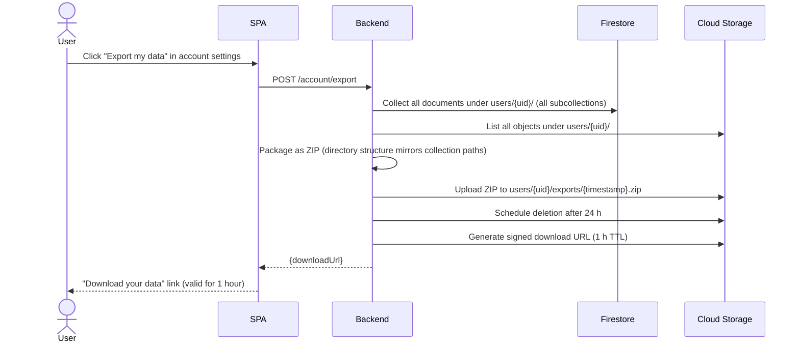

# UC-ACCOUNT-002: Export user data

| | |
|---|---|
| **Actor** | User |
| **Preconditions** | Signed in |
| **Milestone** | M1 |
| **Credit cost** | None |
| **LLM** | No |

## Context

GDPR Article 20 (data portability) right. The export collects all Firestore documents
and Cloud Storage objects for the user, packages them as a ZIP, and returns a
time-limited download link.

The ZIP is stored in Cloud Storage under `users/{uid}/exports/` and deleted after 24 h.

## Flow

## Postconditions

- ZIP available at signed URL for 1 hour.
- ZIP deleted from Cloud Storage after 24 hours.
- No Firestore data modified.

## E2E scenarios

| Scenario | File | Describe block |
|---|---|---|
| Export returns a download URL | `e2e/account.spec.ts` | `UC-ACCOUNT-002 export returns url` |
| ZIP contains all user Firestore collections | `e2e/account.spec.ts` | `UC-ACCOUNT-002 zip contains all data` |
