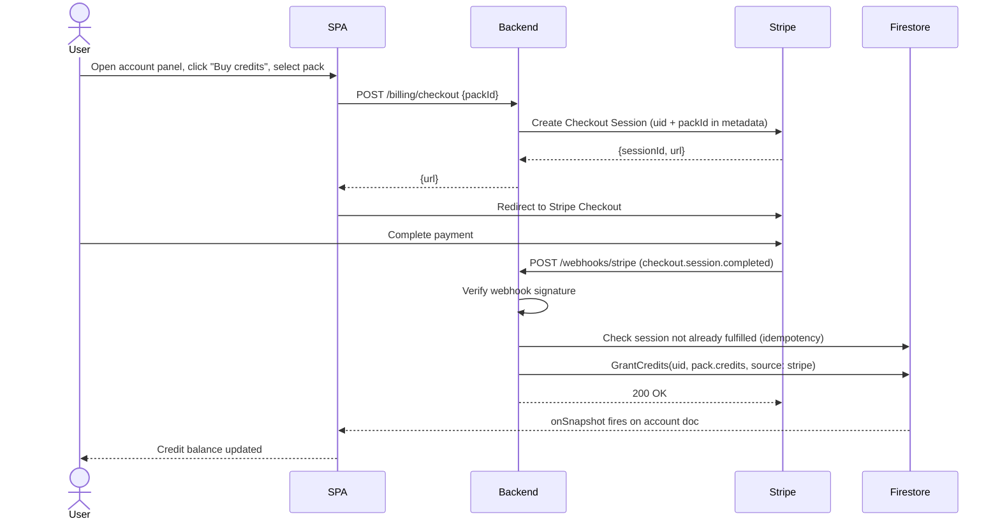

# UC-BILLING-001: Purchase credits

| | |
|---|---|
| **Actor** | User + Stripe |
| **Preconditions** | Signed in |
| **Milestone** | M1 |
| **Credit cost** | None (this is how credits are acquired) |
| **LLM** | No |

## Context

Credits are the internal currency for LLM-backed operations. Stripe is the payment
adapter — it is one way to acquire credits, not the only way. Credits can also be
granted manually (e.g. admin grant, beta allocation) by writing directly to
`users/{uid}/account.credit_balance` in Firestore. The credit model is independent
of Stripe.

## Credit packs

| Pack | Price | Credits |
|---|---|---|
| `pack_10` | $10 | 20 |
| `pack_25` | $25 | 60 |
| `pack_50` | $50 | 130 |

## Flow

## Idempotency

The webhook handler stores fulfilled session IDs in Firestore. Duplicate deliveries
return `200` immediately without re-granting credits.

## Alternative flows

### Payment cancelled

User clicks "Cancel" on Stripe Checkout → redirected to `/account?checkout=cancel`.
No credit granted. No state changed in Firestore.

### Webhook signature invalid

Backend returns `400`. Stripe will retry. No credits granted.

## Postconditions

- `account.credit_balance` increased by pack credit amount.
- A `PurchaseRecord` with `source: stripe` appended to `account.purchaseHistory`.

## E2E scenarios

| Scenario | File | Describe block |
|---|---|---|
| Checkout redirects to Stripe | `e2e/billing.spec.ts` | `UC-BILLING-001 checkout redirect` |
| Webhook grants credits and updates balance | `e2e/billing.spec.ts` | `UC-BILLING-001 webhook grants credits` |
| Duplicate webhook does not double-grant | `e2e/billing.spec.ts` | `UC-BILLING-001 webhook idempotency` |
| Cancel redirect shows no-change state | `e2e/billing.spec.ts` | `UC-BILLING-001 cancel redirect` |
