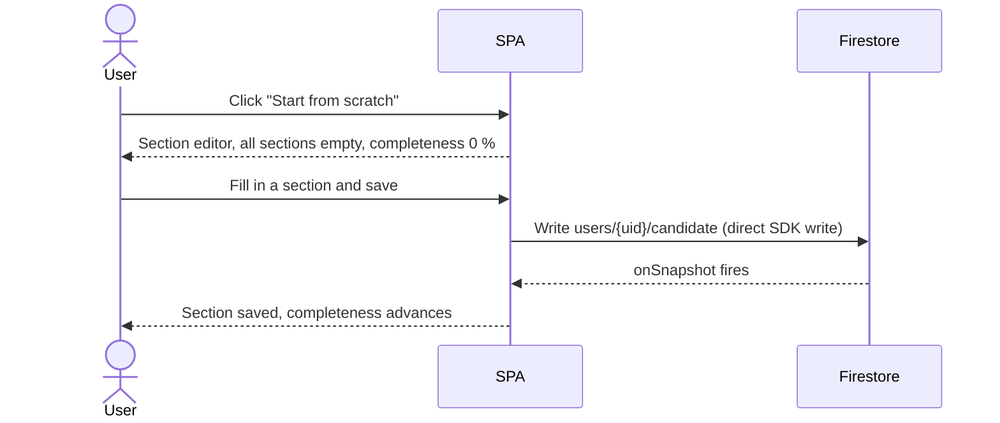

# UC-CV-001: CV page — entry points

| | |
|---|---|
| **Actor** | User |
| **Preconditions** | Signed in |
| **Milestone** | M1 |
| **External request** | None |
| **LLM** | No |

## Context

`/profile/cv` is the user's first meaningful destination after signing up. When no CV exists the
page offers two starting points: filling in sections manually, or importing from a PDF
(which is a separate, external-request use case — see [UC-CV-002](UC-CV-002-import-cv.md)).

When a CV already exists, the page shows the populated editor instead (see
[UC-CV-003](UC-CV-003-edit-cv.md)).

## Empty state

```
┌──────────────────────────────────────────────────────────┐
│  Your CV                                                  │
│                                                           │
│  ┌────────────────────────────────────────────────────┐  │
│  │                                                    │  │
│  │  You haven't added a CV yet.                      │  │
│  │                                                    │  │
│  │  [ Start from scratch ]   [ Import from PDF ◆ ]  │  │
│  │    (plain button)            (ThinkButton)         │  │
│  │                                                    │  │
│  └────────────────────────────────────────────────────┘  │
└──────────────────────────────────────────────────────────┘
```

**Start from scratch** opens the section editor with all sections empty.  
**Import from PDF** opens the PDF upload modal; the right-edge diamond marks it as a external-request action (UC-CV-002).

## Flow: start from scratch



No backend call, no external request. Handled entirely by the Firestore client SDK under the
Security Rules that permit `users/{uid}/candidate` writes by the owning user.

## Analytics gate

Analytics features (Quick Analysis, Generate Bundle) require the profile completion meter
to be ≥ 2/5 (personal data + at least one work experience entry). Until that threshold is
met, `<ThinkButton>` elements for those actions are disabled with the tooltip
"Complete your profile first (2 of 5 required)".

The CV page is where segments 1 (personal data), 2 (work experience), and 4 (education)
are satisfied. See [UC-ONBOARD-001](UC-ONBOARD-001-profile-completion.md) for the meter
and gate behaviour.

## Postconditions

- User started from scratch: a `candidate` document exists with at least one section
  populated and `cv.updatedAt` set.
- User chose PDF import: see [UC-CV-002](UC-CV-002-import-cv.md).

## E2E scenarios

| Scenario | File | Describe block |
|---|---|---|
| `/profile/cv` with no CV shows empty state with both entry points | `e2e/cv.spec.ts` | `UC-CV-001 empty state renders` |
| "Start from scratch" renders section editor at 0 % completeness | `e2e/cv.spec.ts` | `UC-CV-001 start from scratch` |
| "Import from PDF" opens upload modal | `e2e/cv.spec.ts` | `UC-CV-001 import entry point` |
| Analytics ThinkButton is disabled below 2/5 completion | `e2e/cv.spec.ts` | `UC-CV-001 analytics gate below threshold` |
| Analytics ThinkButton enables after personal data + experience saved | `e2e/cv.spec.ts` | `UC-CV-001 analytics gate unlocks at 2/5` |
