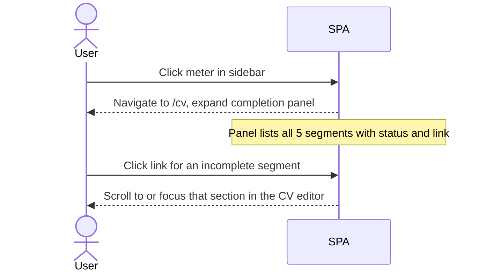

# UC-ONBOARD-001: Profile completion meter

| | |
|---|---|
| **Actor** | User |
| **Preconditions** | Signed in |
| **Milestone** | M1 |
| **Credit cost** | None |
| **LLM** | No |

## Context

The profile completion meter gives users a persistent signal of how much of their profile
is filled in and what they are missing. It also gates analytics features: Quick Analysis
and Generate Bundle are disabled until ≥ 2 segments are satisfied.

The meter disappears entirely once all 5 segments are satisfied — it is an onboarding
aid, not a permanent UI element.

## Segments

| # | Label | Satisfied when |
|---|---|---|
| 1 | Personal details | `cv.personal` has a name and at least one contact field |
| 2 | Work experience | `cv.experience` has ≥ 1 entry |
| 3 | Story | `storyBank` has ≥ 1 entry |
| 4 | Education | `cv.education` has ≥ 1 entry |
| 5 | Portfolio evidence | `evidenceLibrary` has ≥ 1 entry |

## Meter states

```
0/5  Red    ◆ ◇ ◇ ◇ ◇   No analytics available
1/5  Amber  ◆ ◇ ◇ ◇ ◇   Profile started, analytics locked
2/5  Green  ◆ ◆ ◇ ◇ ◇   Analytics unlocked
3/5  Green  ◆ ◆ ◆ ◇ ◇
4/5  Green  ◆ ◆ ◆ ◆ ◇
5/5  —      (hidden)    Meter removed from sidebar
```

Five 2:1 rhombus pips — same shape and clip-path as every other diamond in the design system.
Filled pips use the status colour; empty pips use `--border`.

## Placement

Desktop sidebar footer — immediately left of the user's display name:

```
┌──────────────────────┐
│  A. User ◆ ◆ ◇ ◇ ◇   │  ← meter hidden at 5/5
│  auser@example.com   │
└──────────────────────┘
```

Mobile — inside the account panel only; not in the persistent top nav.

## Flow: user clicks the meter



## Completion panel (expanded on /cv)

Appears below the page header when triggered by a meter click, or on first visit
when the meter is below green. Collapses once all 5 segments are satisfied.

```
┌─────────────────────────────────────────────────────────────┐
│  Complete your profile                              [◑] 2/5 │
│                                                             │
│  ✓ Personal details          → already filled               │
│  ✓ Work experience           → already filled               │
│  ○ Story                     → Add a story                  │
│  ○ Education                 → Add education                │
│  ○ Portfolio evidence        → Add evidence item            │
│                                                             │
│  Analytics are now available. Add more to improve results.  │
└─────────────────────────────────────────────────────────────┘
```

Each incomplete row is a link that scrolls to or focuses the relevant section.

## Analytics gate behaviour

When meter < 2/5, any `<ThinkButton>` for Quick Analysis or Generate Bundle renders
disabled with a tooltip: _"Complete your profile first (2 of 5 required)"_.

The button is visible but non-interactive — the user can see what they are working toward.

## E2E scenarios

| Scenario | File | Describe block |
|---|---|---|
| Meter shows red at 0/5 on fresh account | `e2e/onboarding.spec.ts` | `UC-ONBOARD-001 red at 0/5` |
| Meter turns amber after personal details saved (1/5) | `e2e/onboarding.spec.ts` | `UC-ONBOARD-001 amber at 1/5` |
| Meter turns green after work experience added (2/5) | `e2e/onboarding.spec.ts` | `UC-ONBOARD-001 green at 2/5` |
| Meter hidden after all 5 segments satisfied | `e2e/onboarding.spec.ts` | `UC-ONBOARD-001 hidden at 5/5` |
| Clicking meter navigates to /cv with completion panel expanded | `e2e/onboarding.spec.ts` | `UC-ONBOARD-001 click navigates to cv` |
| ThinkButton disabled with tooltip below 2/5 | `e2e/onboarding.spec.ts` | `UC-ONBOARD-001 analytics gate disabled` |
| ThinkButton enabled at 2/5 | `e2e/onboarding.spec.ts` | `UC-ONBOARD-001 analytics gate enabled` |
