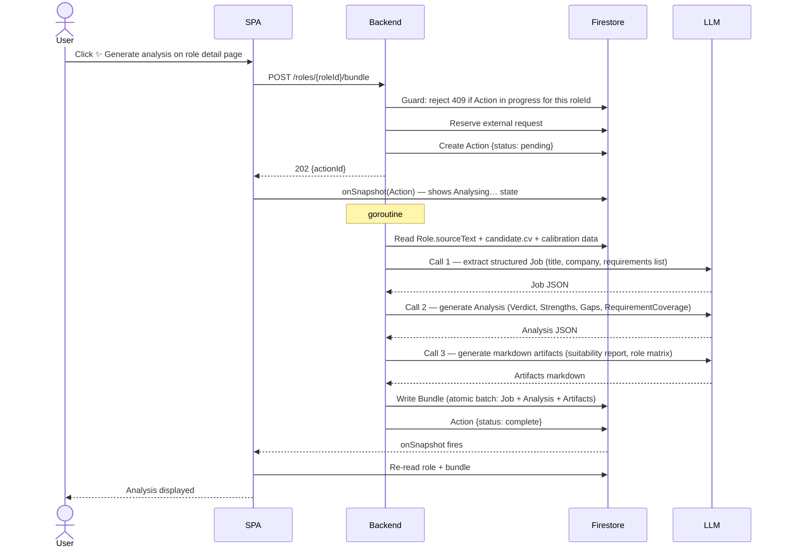

# UC-ROLE-003: Generate bundle

| | |
|---|---|
| **Actor** | User |
| **Preconditions** | Signed in; role exists with `sourceText`; external requests available; no bundle generation already in progress for this role |
| **Milestone** | M3 |
| **External request** | 1 |
| **LLM** | Yes — three sequential calls: job extraction, analysis, artifact generation |

## Context

Bundle generation is the core AI pipeline. It produces the structured assessment a user
acts on: Verdict, Strengths, Gaps, Requirement Coverage, and markdown artifacts.

Calibration data is injected into the prompts when sufficient historical data exists
(≥ 3 completed gap tasks for Task Calibration; ≥ 3 role outcomes per verdict group for
Assessment Calibration). Both are omitted silently when data is insufficient.

## Flow

## Alternative flows

### Any LLM call fails

Goroutine releases the external request (best-effort), sets Action to `{status: failed, reason: <step name>}`.
SPA shows error toast. No partial Bundle is written.

### Double-click / duplicate request

`409` returned immediately if an Action with type `bundle_generation` is already in
progress for this roleId. No external request reserved.

### External request unavailable

The external-request gate reports the request unavailable. The backend returns a
user-safe error before creating an Action.

## Postconditions

- `users/{uid}/roles/{roleId}/bundle` written with Job, Analysis, and Artifacts.
- `bundle.generatedAt` set to current time.
- 1 external request reserved.
- Role detail page shows Verdict and full analysis.

## E2E scenarios

| Scenario | File | Describe block |
|---|---|---|
| Generate bundle shows Analysing… then displays verdict | `e2e/roles.spec.ts` | `UC-ROLE-003 bundle generation flow` |
| Duplicate request returns 409 | `e2e/roles.spec.ts` | `UC-ROLE-003 double click guard` |
| External request released on LLM failure | `e2e/roles.spec.ts` | `UC-ROLE-003 external request released on failure` |
| Blocked at external request unavailable | `e2e/roles.spec.ts` | `UC-ROLE-003 blocked at external request unavailable` |
