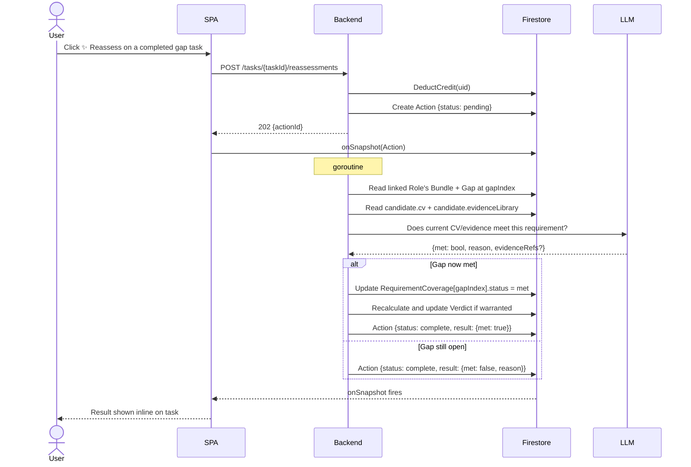

# UC-TASK-002: Reassess gap task

| | |
|---|---|
| **Actor** | User |
| **Preconditions** | Signed in; gap task exists and is linked to a role with a bundle; ≥ 1 credit |
| **Milestone** | M3 |
| **Credit cost** | 1 |
| **LLM** | Yes — gap reassessment |

## Context

After completing a gap task (e.g. obtaining a certification), the user can ask the LLM
whether their CV and evidence library now satisfy the linked gap requirement.
If yes, the gap is closed in the Analysis and the Verdict may improve.

## Flow

## Postconditions

- If met: gap closed in Analysis; Verdict may have improved; 1 credit deducted.
- If still open: no Analysis change; 1 credit deducted; reason shown to user.

## E2E scenarios

| Scenario | File | Describe block |
|---|---|---|
| Reassess closes gap and updates verdict | `e2e/tasks.spec.ts` | `UC-TASK-002 gap closed` |
| Reassess returns still-open with reason | `e2e/tasks.spec.ts` | `UC-TASK-002 still open` |
| Credit deducted in both outcomes | `e2e/tasks.spec.ts` | `UC-TASK-002 credit deducted` |
